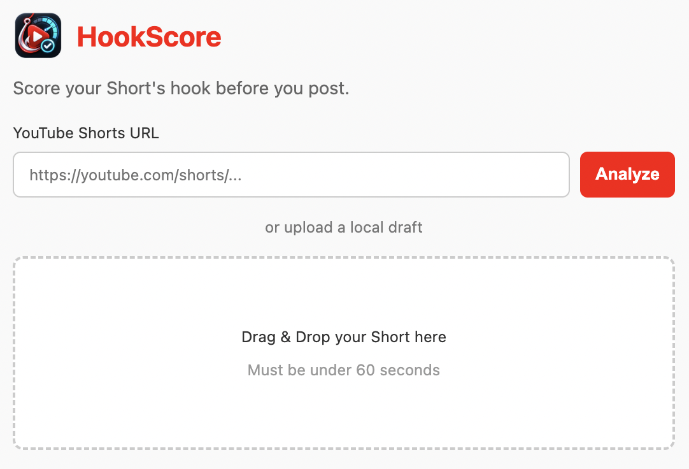

# HookScore

Score your Short's hook before you post.

HookScore is a Chrome extension with a local backend. Upload a draft video or paste a YouTube Shorts URL, then get a Hook Score with clear improvement suggestions.



<video src="docs/media/HookScore.mp4" controls width="900"></video>

## Setup

Create `backend/.env`:

```env
AZURE_OPENAI_API_KEY=your_openai_api_key
AZURE_OPENAI_ENDPOINT=https://your-openai-compatible-host.com
AZURE_OPENAI_DEPLOYMENT_NAME=your_model_or_deployment_name
AZURE_OPENAI_API_VERSION=your_api_version
AZURE_OPENAI_API_URL=https://your-openai-compatible-host.com/your/responses/path
YOUTUBE_API_KEY=your_youtube_data_api_v3_key
OPENAI_TIMEOUT_SECONDS=180
```

Optional, only if your local Whisper paths are different:

```env
FFMPEG_PATH=/opt/homebrew/bin/ffmpeg
WHISPER_CLI_PATH=/opt/homebrew/bin/whisper-cli
WHISPER_MODEL_PATH=/path/to/your/whisper-model.bin
```

Keep `.env` private.

## Start Backend

```bash
cd /Users/debi.pradhan/Documents/R_d/shorts-viral-predictor/backend
python3 -m venv .venv
source .venv/bin/activate
pip install -r requirements.txt
uvicorn main:app --reload --port 8765
```

Check:

```bash
curl http://localhost:8765/health
```

Expected:

```json
{"status":"ok"}
```

## Load In Chrome

1. Open `chrome://extensions`.
2. Enable **Developer mode**.
3. Click **Load unpacked**.
4. Select:

```text
/Users/debi.pradhan/Documents/R_d/shorts-viral-predictor/extension
```

5. Pin **HookScore**.
6. Click the extension icon.
7. Click **Open Analyzer**.

## Use HookScore

Analyze a local draft:

1. Drag and drop a video under 60 seconds.
2. Wait for transcription and evaluation.
3. Review the Hook Score and suggestions.

Analyze a YouTube Short:

1. Paste a Shorts URL.
2. Click **Analyze**.
3. Review the Hook Score and suggestions.

Supported URLs:

```text
https://www.youtube.com/shorts/VIDEO_ID
https://www.youtube.com/watch?v=VIDEO_ID
https://youtu.be/VIDEO_ID
```

Local upload uses Whisper transcription. YouTube URL mode uses YouTube title, description, tags, stats, and trend context.

## Result

HookScore gives you:

- Hook Score percentage
- Title and hook suggestions
- Pacing and caption tips
- Hashtag, description, cover, CTA, posting, and testing advice

## Troubleshooting

Backend offline:

```bash
curl http://localhost:8765/health
```

Port already in use:

```bash
uvicorn main:app --reload --port 8766
```

Then update the backend URL in `extension/analyzer.js`.

No transcript: check that the video has clear speech and your Whisper paths are correct.

AI timeout: increase `OPENAI_TIMEOUT_SECONDS` in `.env` and restart the backend.
